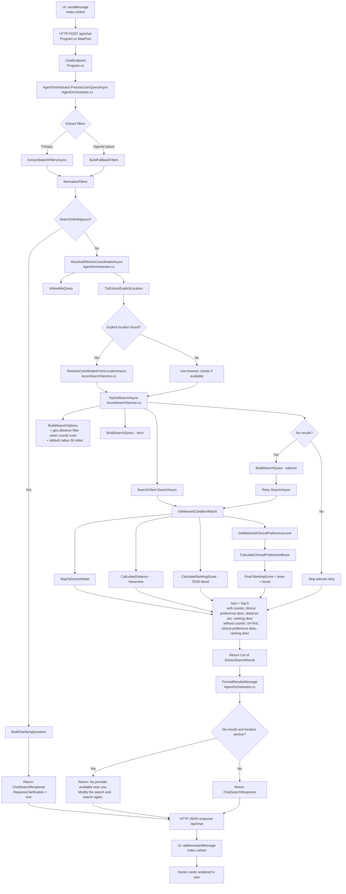

# Chat Request Flow Chart

This diagram shows the function-level call flow across files from user chat input to rendered response.

## Notes

- Entry point for backend chat processing is `ChatEndpoint` in [src/FindDoctor.Web/Program.cs](src/FindDoctor.Web/Program.cs).
- Core orchestration is in `ProcessUserQueryAsync` in [src/FindDoctor.Web/Services/AgentOrchestrator.cs](src/FindDoctor.Web/Services/AgentOrchestrator.cs).
- Core search execution/ranking is in `HybridSearchAsync` in [src/FindDoctor.Web/Services/AzureSearchService.cs](src/FindDoctor.Web/Services/AzureSearchService.cs).
- Geo pre-filtering is applied before ranking when a location anchor is present, with a default 50-mile radius.
- Clinical-term preference level is computed from `ClinicalPreferenceMap` and applied both as a sort key and ranking boost.
- The empty-result response for location-anchored searches is an explicit no-provider message.
- Browser request and rendering are in [src/FindDoctor.Web/Pages/Index.cshtml](src/FindDoctor.Web/Pages/Index.cshtml).
